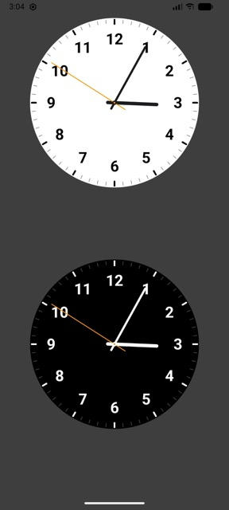

# AndroidClockWatch - ClockView for Android

一个优雅的、高度可自定义钟表自定义View，支持平滑动画和夜间模式切换。

## 特性

- **风格设计**：完美的比例、经典的配色。
- **丝滑动画**：支持秒针、分针、时针的连续平滑转动，非跳动式更新。
- **高度自定义**：通过 XML 属性轻松配置表盘、指针、刻度及数字的颜色。
- **轻量级**：纯 Canvas 绘制，无额外图片资源，性能优异。




## 安装

### 1. 添加 JitPack 仓库

在你的根目录 `settings.gradle.kts` 或 `build.gradle` 中添加 JitPack：

```kotlin
dependencyResolutionManagement {
    repositories {
        google()
        mavenCentral()
        maven { url = uri("https://jitpack.io") }
    }
}
```

### 2. 添加依赖

在模块级 `build.gradle.kts` 中添加：

```kotlin
dependencies {
    implementation("com.github.kevinvane:AndroidClockWatch:1.0.0")
}
```

## 使用方法

### XML 布局

在 XML 中直接添加 `ClockView`。你可以通过自定义属性来适配日间或夜间模式：

#### 日间模式 (默认样式)
```xml
<com.github.kevinvane.clocklib.ClockView
    android:id="@+id/clockView"
    android:layout_width="300dp"
    android:layout_height="300dp" />
```

#### 夜间模式 (自定义颜色)
```xml
<com.github.kevinvane.clocklib.ClockView
    android:id="@+id/clockViewDark"
    android:layout_width="300dp"
    android:layout_height="300dp"
    app:clockFaceColor="#000000"
    app:clockHandColor="#FFFFFF"
    app:clockHourTickColor="#FFFFFF"
    app:clockTextColor="#FFFFFF"
    app:clockTickColor="#48484A"
    app:clockSecondHandColor="#FF9500" />
```

## 自定义属性说明

| 属性名 | 说明 | 默认值 |
| :--- | :--- | :--- |
| `clockFaceColor` | 表盘背景颜色 | `#FFFFFF` |
| `clockHandColor` | 时针和分针颜色 | `#1C1C1E` |
| `clockSecondHandColor` | 秒针及中心点颜色 | `#FF9500` |
| `clockTickColor` | 分钟刻度颜色 | `#8E8E93` |
| `clockHourTickColor` | 小时刻度颜色 | `#000000` |
| `clockTextColor` | 数字刻度颜色 | `#000000` |

## 许可证

```
Copyright 2026 kevinvane

Licensed under the Apache License, Version 2.0 (the "License");
you may not use this file except in compliance with the License.
You may obtain a copy of the License at

    http://www.apache.org/licenses/LICENSE-2.0

Unless required by applicable law or agreed to in writing, software
distributed under the License is distributed on an "AS IS" BASIS,
WITHOUT WARRANTIES OR CONDITIONS OF ANY KIND, either express or implied.
See the License for the specific language governing permissions and
limitations under the License.
```
